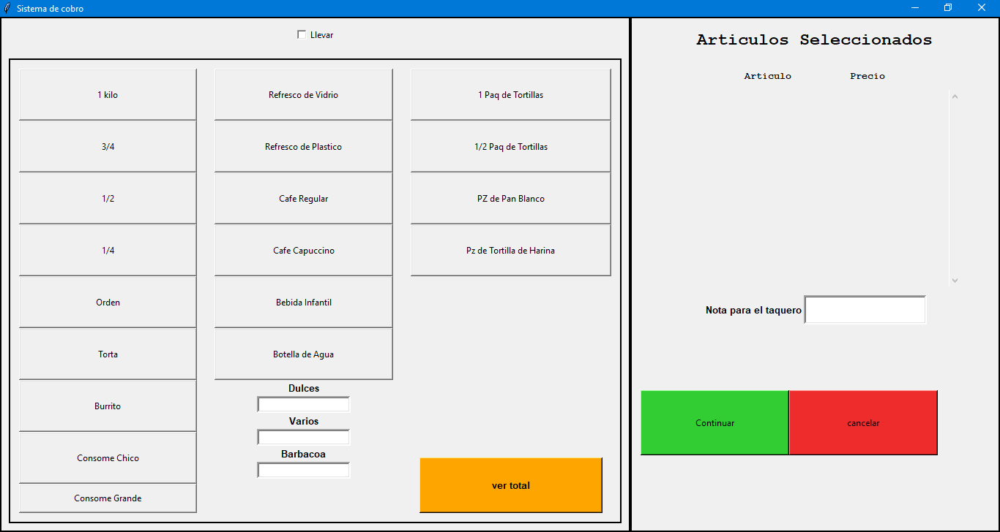
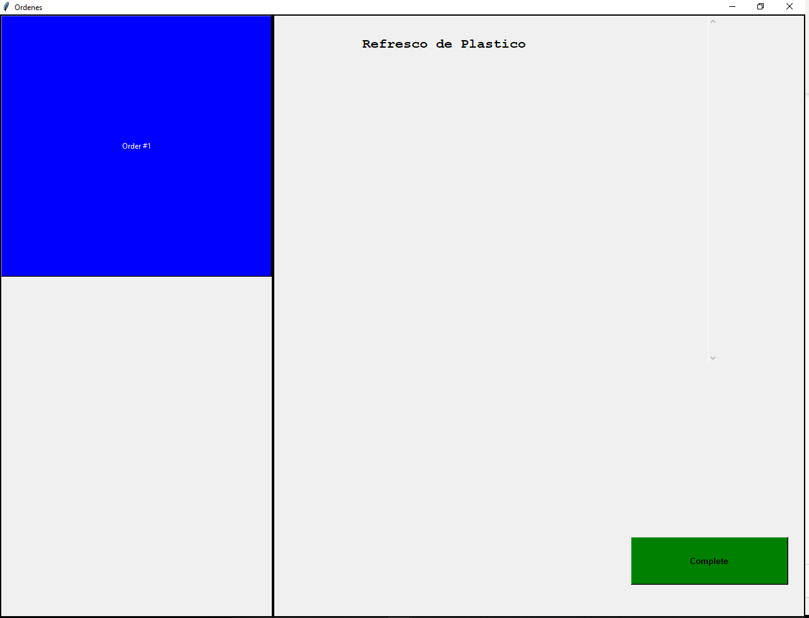

# Cashier-Chef Ordering System (CCOS)
Repository for CCOS

## Introduction
The system provides a method of ordering on a restaurant, where the client goes to the cashier and he orders its food. The cashier selects the food ordered by the customer and when the cashier selects that the order was paid, the order is sent to the chef. The chef will have a PC displaying a queue of the orders. The chef will then be able to click/touch on any order number, see its content and selects it as complete, in which case, the order will dissapear from the queue.

Cashier:  
  
Chef:  

## Technologies
### Languages
-Python 3
### Libraries
-EasyTkinter 1.1.0 
-PyInstaller 3.6 
-XlsxWriter 1.2.8 
-future 0.18.2 
-openyxl 3.0.3 
-threadsafe-tkinter 1.0.2 

## Prerequisites
The following software is needed to install and run the system: 
		-Python 2.7 or higher 
		
The following hardware is needed to install and run the system: 
		-Two PCs running in a same network 
    
## Installation
For installing the system just download the files and make sure that the two computer that are running the system are on the same network.

## Deployment
Before turning the system on the PCs, we need to make sure that the PCs are connected in the same network and that sockets can communicate.

First,on the chef PC, go to the chef.py program and change the IP to the IP of the chef computer. Then,on the cashier PC, go to client.py and change the IP to the IP of the chef computer.

Now, go to the file explorer on both PC and click on network on the left sidebar. The computers of the system needs to appear on the window, showing they are in the same network. 

After that, open the command window and type the following:

On cashier: ping *Chef PC IP address* - It need to show a connection was made succesfully
On chef: ping *Cashier PC IP addess*  - It need to show a connection was made succesfully

Then, open Windows Defender Firewall Advanced Security. On the left panel of the window, click on Inbound rules. Create a new rule by clicking on New Rule on the right panel of the window.
Click on port on the new window that pops up. Select TCP rule and type in the specific port you are going to use to connect between the PCs 
(You can select the port by going to the chef.py and server.py files anf change it, it needs to be >1024). Click on next until a Name text box appears and put
any desired name for the rule. Then click finished. Do this firewall step for both PCs. You can now run the system.

To run the system, the chef.py need to be ran first, as it is the server for the sockets, then cashier need to be run to connect to the server. 

## Launch
Go to the project folder. First run the chef, as it is going to be the socket server, and after that run the cashier, which is the client socket.

## Description
### Context
This started as a personal project to provide a system for a mexican taqueria to make it easier to get the order to the chef from the cashier 
and easily be aware of the sales obtained per day.
		
### What can the project specifically do
The system gets the order form the cashier and sents it to the chef. The chef then obtains the order an it is added to a list. The chef sees his specific
interface on a PC, which contains a list of the orders on the left side, and on the right side the content of the order he clicks. Every order that is
completed on the day, every day, gets stored in an excel file. Each excel file has the orders of the days and its title is the date the orders were taken. The files
also show the total orders and sales of each day. All the files are stored in a folder called Inventory that is created inside the priject folder.

### Features
#### Cashier
-Items can be selected from the menu by clicking on the buttons on its interface. 
-Text boxes to choose total cost for certain special Items. 
-Select if the order is to go by clicking on a checkbox. 
-See the total cost of the order on its interface. The button see total needs to be clicked before sentind the order. 
-Interface will reset automatically after sending the order to the chef. 
-The order individual items and cost will be displayed when selected on the cashiers interface. 
-The order can be cancelled at any time before sending it to the chef. 
-Send a note to the chef along with the order. 
#### Chef
-See a list of uncompleted orders. 
-Ability to toggle thru the orders to see its content, by clicking on the order number. 
-Select an order as completed, which would eliminate it from the list. 
#### Others
-A inventory folder is created inside the project folder, if it is not already created. 
-An excel file is generated per day, in which every order is stored, along with the total orders per day and total sales. 
	
### Links
Demo Link: 

## Usage
This system can be used in any restaurant where the order is taken by a cashier. This particular code was made with a menu for a Mexican restaurant, but it can easily be modified to fit the menu of any restaurant.

## Support
For any questions, do not hesistate to contact the authors.

## Roadmap
In the future, we will connect the system to a ticket machine and print a ticket for the client. This will happen when the system is implemented on a restaurant.

## Authors and Acknowledgements
Alejandro Ibarra Polanco - alejandro.ibarra.p@gmail.com   Hugo Ocon - oconhugo14@gmail.com

## Project Status
Complete
